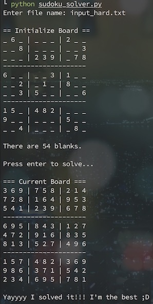

# Sudoku Solver

A simple script that solves Sudoku.

## Installation

```bash
git clone https://github.com/hsuanhauliu/sudoku-solver.git
cd sudoku-solver
```

## Usage

Create a text file (.txt) that contains the game you want to solve with the following format:

- Enter the numbers row by row and separate each number with a space.
- Use 0 to indicate empty cells.
- The game must be solvable.

 See [samples](samples/) for examples.

```bash
python sudoku_solver.py
```

### Screenshot


