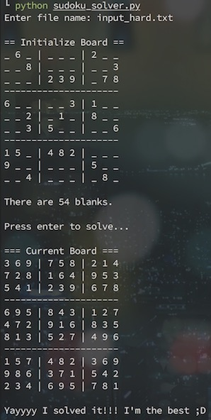

# Sudoku Solver

A simple program that solves Sudoku using 3 different approaches.

## Getting Started

These instructions will get you a copy of the project up and running on your local machine for development and testing purposes.

### Installation

A step by step series of examples that tell you how to get a development env running.

1. Clone the repo.

```
git clone https://github.com/hsuanhauliu/sudoku-solver.git
cd sudoku-solver
```

2. Create a text file (.txt) that contains the game you want to solve with the following format:
 - Enter the numbers row by row and separate each number with a space.
 - Use 0 to indicate empty cells.
 - The game must be solvable.
 
 See [sample-games](sample-games/) for examples.

## Usage

Follow the commands below to run the program.

```
python sudoku_solver.py
```

### Screenshot:

